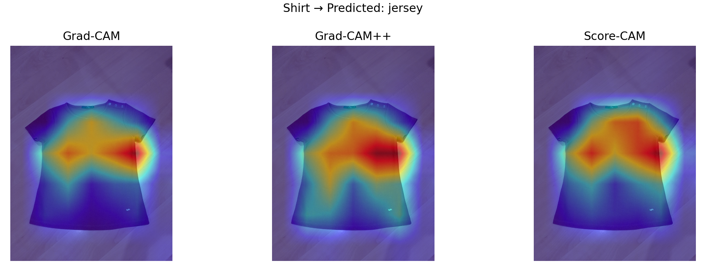
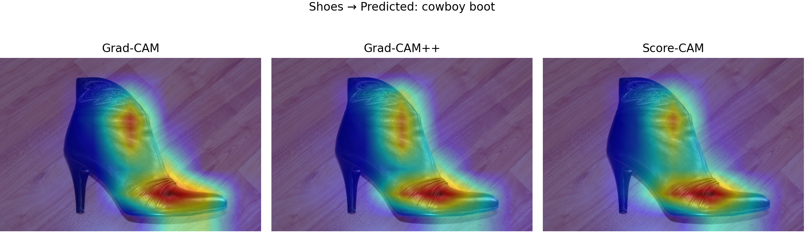
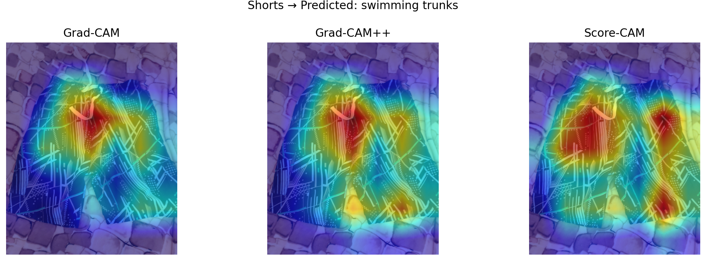
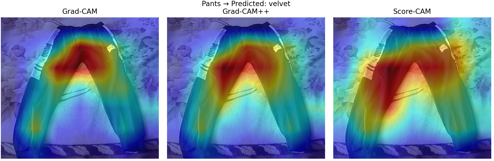
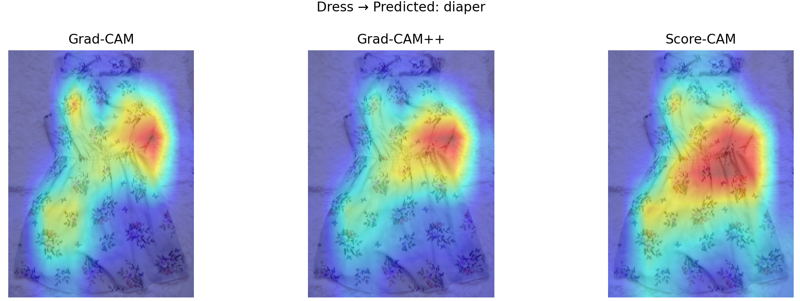

# CV-Explainability

### shirt

### shoes

### shorts

### pants

### dress

I expected resnet to locate the perimeter and apply judgement from that information as that would make the most logical sense, but that was often not the case. It became hyperfixated on some spot and was able to draw conclusions from there. For the shirt all GradCAMs found information from the same area with Score-CAM using the most information in the image, identifying a shrit as a jersey which is quite close.    For the shoe, all methods were basically the same in explaining the model, all highglighting almost exactly the same. It seemed to find the toe transition of the image highly relevant as well as the upper part of the boot. It can be said that this isn't really a shot and more of a boot and the model predicted cowboy boot which it is similar to.
  
The shorts were classified as swimming trunks which is another close one and it seemed the waist height was an identifier for this.
  
The pants and dress were both grossly misclassified as velvet and a diaper. The GradCAMs show a focus in an unpredictable area. I guess it can be said that the lack of sense in the explainability of the GradCAM method explains why the model performed poorly here, its all wrong. 

### Importance
One convenience I always wished I had was to see myself in different clothes without wearing them. A simulated try-on. Clothing classification is the first step to this hence this project. Explaining classifications in this domain is important because of error cases. Say someone is looking for clothes similar to the dress they are wearing but the model sees it as a diaper and recommends other diapers. That would be a bad misclassification and having explainability goes far for tuning and better adjusting the task.